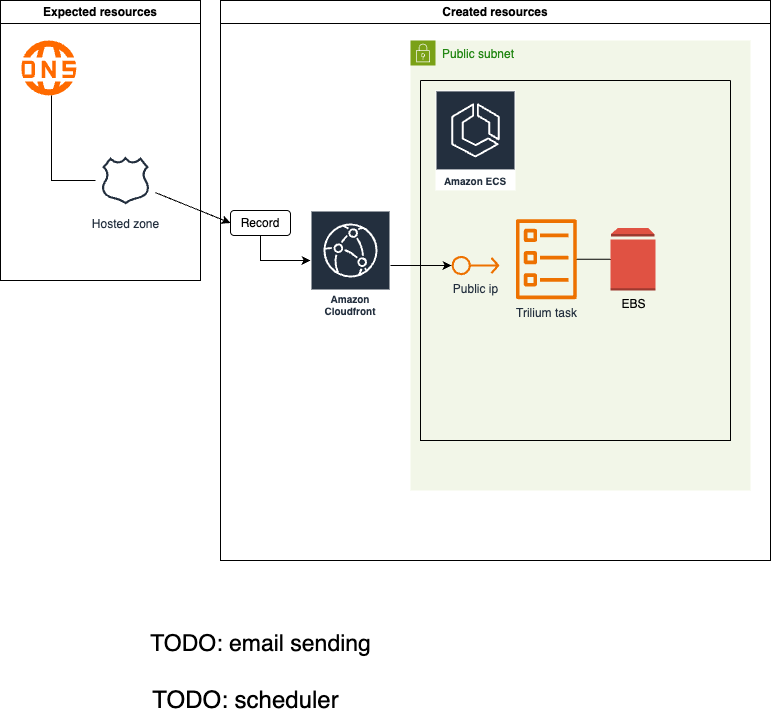

# Trilium ECS

## TODO
- TODO: task management
- TODO: backup & restore
- TODO: Checkov checks
- TODO: Automatic deployment from GitHub

## Functional requirements
- Trilium
- Task management: pages with title starting with date pattern used as e-mail notification
  - "xxxx-12-14 Something" notified every year on 14th Dec
  - "2025-xx-10/20 Something2" notified every month in 2025 on 10th and 20th
  - ....

## Non-functional requirements
- Minimal monthly cost

## Architecture

## How to install
- Requirements
  - AWS account
  - Registered domain + Hosted zone
- 